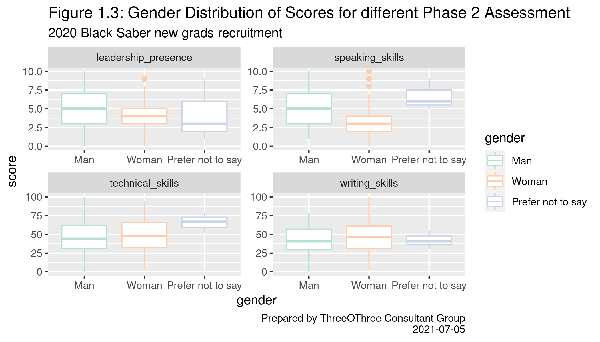
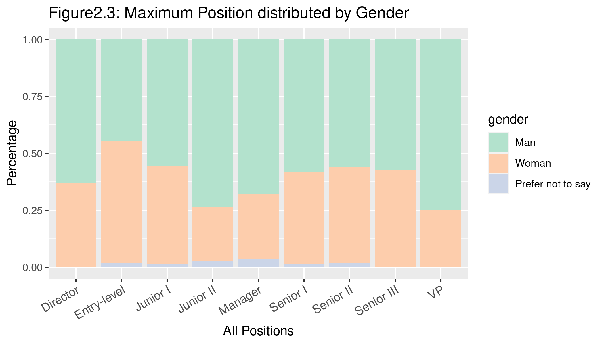
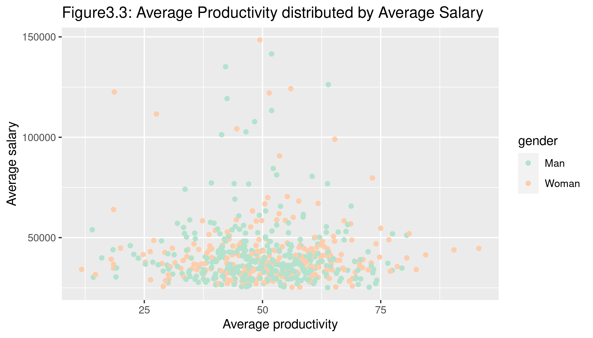

```{r load_data, include=FALSE,warning=FALSE, message=FALSE}
# Import Data
library(gridExtra)
library(tidyverse)
library(readxl)
library(readr)
library(janitor)
library(opendatatoronto)
library(ggthemes)
library(lme4)
library(tidyverse)
library(dplyr)
library(ggplot2)
library(DataExplorer)
library(nlme)

phase1_raw = read_csv("data/phase1-new-grad-applicants-2020.csv")
phase2_raw = read_csv("data/phase2-new-grad-applicants-2020.csv")
phase3_raw = read_csv("data/phase3-new-grad-applicants-2020.csv")
final_raw = read_csv("data/final-hires-newgrad_2020.csv")
current = read_csv("/cloud/project/data/black-saber-current-employees.csv")
```

\newpage
# Executive summary

This report is committed to analyzing the general hiring, promotion, and salary distribution of the company Black Saber Software. Specifically, this report will test the AI-automated service that intervenes in the company’s hiring process and finds out if the system has any unfair rating standards for certain applicants. Also, this report will test and discuss if the promotion process and salary distribution are mainly depending on employees’ talent and value to the company.
The report uses data (of applicants and current employees) provided by Black Saber Software and proposes four relevant research questions. For each of the hiring phases, is gender a determinant factor rather than their talents for applicants entering the next phase?  For the current employees, are males being preferred at a higher position on average? Whether the average productivity of an employee is a crucial factor that affects his/her position? Is the company’s salary distribution mainly depending on one’s value produced or is it partially affected by the employee’s gender difference?


$\underline{\text{Key Findings}}$:

* Hiring: 
  + Gender is not considered as a determinant factor in all three phases of hiring. In addition, there is no gender bias for the AI automated selection pipeline analyzing the pre-recorded video of applicants. (Refer to figure 1.3 listed below) 
  + For applicants who successfully enter phase 2 from phase 1, the passing status is based on the applicants' GPA, extracurriculars, and working experiences.
  + AI automated selection pipeline is based on talent of the applicant. Each point increase in the score assessed by the system will increase the probability of hiring by 1 - 2 times. Meanwhile, the interview phase is not gender biased either.


* Promotion:
  + Among the current employees, males are more preferred at higher positions on average. There is a gender bias on the overall promotion process in the company. (Refer to figure 2.2 listed below)
  + The software team and design team are the two teams with the highest percentage of males, and they are also the two teams with the highest average promotion rate.
  + The average productivity is not a significant reason for their promotion, which means that an employee who produces more outputs might not necessarily get a promotion. 


* Salary:
  + Current employees’ salary are highly related to their average seniority (position), and salary is also partially affected by the employee’s gender.
  + The ratio of those having high productivity among females is higher than the ratio of the males. However, the ratio of those earning high salaries among females is lower than the ratio among males. (Refer to figure 3.3 listed below)


$\underline{\text{Limitations}}$:

* When dealing with the interview phase (the third round) in the hiring process, the interviewer's grading criterion is unclear (maybe subjective/biased).
* In the data collected, there is no specific standard to qualify employee’s productivity. Thus, it may lead to some inaccurate or biased analysis related to productivity. (e.g., an employee in a different team and with a different position has diverse work type/workload)
* Currently, the number of male employees is higher than that of females which may lead to an inevitable bias when analyzing gender related problems.

$\underline{\text{Figures}}$:
 

{width=45%}

{width=45%}
 
{width=45%}


\newpage
# Technical report

## Introduction

It is no doubt that the hiring and remuneration processes concern potential bias and companies are challenged to develop fair processes that are based on talent and value to the company.  In this report, we took a deep look at the topic of gender parity on hiring, promotion, and salary processes. We also conducted an analysis of the deterministic factors on hiring, promotion, and salary processes to evaluate the rationality of Black Saber Software company’s hiring and incentive mechanisms. 


### Research questions
* Potential bias in hiring process
  + For each of the hiring phases, is gender a deterministic factor rather than their talents for applicants entering the next phase? 
* Potential bias in promotion process 
  + Part a: Are males being preferred at higher position on average?
  + Part b: If the mean productivity of an employee is a key factor affect his/her position in this company on average?
* Potential bias in salary  
  + Does evidence that current employees’ wages depend on their gender rather than their value to the company exists in the Black Saber Software Company?
  
\newpage
## Hiring: gender distribution in hiring phases

```{r join, include=FALSE,echo=FALSE, warning=FALSE, message=FALSE}
phase1_raw %>% filter(is.na(phase1_raw))
phase2_raw %>% filter(is.na(phase2_raw))
phase3_raw %>% filter(is.na(phase3_raw))

phase2_join <- phase2_raw %>% select("applicant_id") %>% mutate("Result" = "Proceed")
phase1 <- left_join(phase1_raw, phase2_join, by = "applicant_id") %>% mutate("Result" = replace_na(Result, "No"))
phase2 = phase2_raw %>% 
  full_join(phase3_raw, by = "applicant_id") %>%
  mutate(pass = ifelse(is.na(interviewer_rating_1),0,1)) %>%
  select(-interviewer_rating_1, -interviewer_rating_2)
phase3 = phase2_raw %>%
  right_join(phase3_raw, by = "applicant_id") %>%
  mutate(pass = ifelse(applicant_id %in% final_raw$applicant_id,1,0))
```

### Background
This section mainly focuses on the AI-automated hiring process operated by the Black Saber Software. From the data given, there is a total of 3 hiring phases to select adequate candidates. More specifically, the first round comprehensively estimates one’s background, which includes one’s gender, the team applied, GPA, presence of cover letter and cv, and relevance of past extracurricular and work experiences. Those who proceed to the second phase are asked to complete a couple of timed tasks, through which technical and writing skills are evaluated by AI. Meanwhile, the rating of speaking skills and leadership presence is graded based on one’s pre-recorded video. The last round is a face-to-face interview, during which the two arbitrary interviewers assess whether each applicant’s performance fits the current job.  

### Research question

To determine whether the hiring process is potentially biased, we want to explore:
Is gender a deterministic factor in each hiring phase?

### Methods

#### $\underline{\text{Study Design, setting, participants}}$\
We analyzed a total of 613 freshly graduated applicants for the 2020 new grad recruitment program for Black Saber company. There are totally 3 hiring phases, with 4 separated datasets provided by Black Saber Software. The first dataset provided includes all available candidates, its source data is from phase1-new-grad-applicants-2020.csv, which includes 8 variables:  

* `applicant_id`: A unique id assigned in Phase 1
* `team_applied_for`: the team the candidate applied for, Software or Data
* `cover_letter`: 0 or 1, 0 for absence of the applicant’s cover letter, and 1 for presence
* `cv`: 0 or 1, 0 for absence of the applicant’s cv, and 1 for presence
* `gpa`: Grade point average, 0.0 to 4.0
* `gender`: Gender of the applicant (Man, Woman, Prefer not to say)
* `extracurriculars`: an estimate of extracurricular experiences assessed by a propriety phrase bank, where 0 for no extracurriculars or no relevant or skillful extracurriculars, 1 for some relevant experiences, and 2 for highly relevant or skill-building experiences
* `work_experience`: an estimate of work experiences assessed by a propriety phrase bank, where 0 for no work experience or no relevant or skillful experience, 1 for some relevant work experiences, and 2 for highly relevant or skill-building work experiences

The file phase2-new-grad-applicants-2020.csv is the source data recording candidates who passed the first round, which includes 5 variables:

* `applicant_id`: A unique id assigned in Phase 1
* `technical_skills`: 0 to 100, graded according to a timed task by AI
* `writing_skills`: 0 to 100, graded according to a timed task by AI
* `speaking_skills`: an estimate of the candidate’s speaking skills through the pre-recorded video, graded by AI
* `leadership_presence`: an estimate of the candidate’s leadership through the pre-recorded video, graded by AI

The file phase3-new-grad-applicants-2020.csv is the source data recording candidates who successfully proceeded to phase 3, which includes 3 variables:  
* `applicant_id`: A unique id assigned in Phase 1
* `interviewer_rating_1`: 0 to 100, an estimate of job fit by the first interviewer
* `interviewer_rating_2`: 0 to 100, an estimate of job fit by the second interviewer

The source data final-hires-newgrad_2020.csv provides the list of candidates that are finally hired, with 1 variable:  

* `applicant_id`: A unique id assigned in Phase 1
To investigate the topic of gender parity, we took a close look at the three phases of hiring processes separately. 

#### $\underline{\text{Data description and data wrangling}}$\
* From phase 1 to phase 2, we concern about whether or not one has passed under the first-round algorithm. Therefore, we left-join phase 1 and 2 to keep the background information for all phase-1 candidates. Then, a new categorical variable called “Result” is created, with “Proceed” for those who proceeded to Phase 2, and “No” for those who got blocked in the first round.
* From phase 2 to phase 3, we particularly examined the applicants’ features rated by the AI automated selection pipeline. We do not know the algorithm behind it, but a higher score means better performance. As stated before, we also included a new categorical column called ‘status’ with two levels, successfully passing the second phase or failing phase 2. We also linked the corresponding gender to all the applicants who entered phase 2.
* For applicants who entered phase 3, the interview phase, we checked two interviewers’ ratings. The rating of job fit is ranging from 0 to 100. We also included the gender information and passing status as potential indicators in the model.

#### $\underline{\text{Statistical method}}$\
We estimated a generalized linear mixed model to study how various features of applicants affect their passing status as we assumed each applicant is independent. Since the passing status only has two distinct levels, we treated it as a binary response variable and analyzed it using the logistic regression model. We also accounted for the potential random effect by the applicant id and the within applied team variation.  

* The first generalized linear mixed model built for phase 1 is:

$logit(Pass_{ij})=\beta_0+\beta_1gender_{ij}+\beta_2cover\_letter_{ij}+\beta_3cv_{ij}+\beta_4GPA_{ij}+\beta_5extracurriculars_{ij}$ $+\beta_6work\_experience_{ij}+b_iteam\_applied\_for_{ij}$

Where i indicates the different team applied for and j indicates the $j_{th}$ applicant in the team they applied for. $team\_applied\_for_{ij}$ is the random effect and we assumed it follows a multivariate normal distribution. All other variables are fixed effects.  

* For all the applicants from phase 2, we built a model as follows:  
$logit(Pass_{ij})=\beta_0+\beta_1gender_{ij}+\beta_2technical\_skills_{ij}+\beta_3leadership\_presence_{ij}$
$+\beta_4speaking\_skills_{ij}+\beta_5writing\_skills_{ij}+b_iteam\_applied\_for_{ij}$

Where i indicates the different team applied for and j indicates the $j_{th}$ applicant in the team they applied for. $team\_applied\_for_i$ is the random effect and we assumed it follows a multivariate normal distribution. All the other variables are the specific features for the $i_{th}$ applicant.  
  
* Finally, we analyzed the model from phase3 to final hire:  
$logit(Pass_{ij})=\beta_0+\beta_1gender_{ij}+\beta_2interviewer\_rating\_1_{ij}+\beta_3interviewer\_rating\_2_{ij}$
$+b_iteam\_applied\_for_{ij}$

Again, where i indicates the different team applied for and j indicates the $j_{th}$ applicant in the team they applied for. $team\_applied\_for_i$ is the random effects and we assumed it follows a multivariate normal distribution.  

After examining the basic model, we dropped the gender covariates in all three models separately and refitted the generalized linear model with everything else unchanged. We also performed a likelihood ratio test on each pair of the full basic model and the gender reduced model to test whether the model excluded gender conveys the same information as before. 

\newpage
### Results

```{r, include=FALSE}
# gender distribution of phase 1
library(grid)
get_legend<-function(myggplot){
  tmp <- ggplot_gtable(ggplot_build(myggplot))
  leg <- which(sapply(tmp$grobs, function(x) x$name) == "guide-box")
  legend <- tmp$grobs[[leg]]
  return(legend)
}
Gender_dis1 <- phase1 %>% 
  ggplot(aes(x = Result,fill = factor(gender, levels = c("Man","Woman","Prefer not to say")))) + 
  geom_bar(position = "fill") +
  theme_minimal()+
  labs(x = "Passing Phase 1",
       y = "percentage")+
  scale_fill_brewer(palette = "Pastel2") +
  theme(legend.title = element_blank(), legend.position = c(.7, .6)) 
legend <- get_legend(Gender_dis1)
Gender_dis1 <- Gender_dis1 + theme(legend.position="none")
```

```{r,include=FALSE}
# gender distribution of phase 2
Gender_dis2 <- phase2 %>% 
  mutate(pass = ifelse(pass == 0, "No", "Proceed")) %>%
  ggplot(aes(x= pass,fill = factor(gender, levels = c("Man","Woman","Prefer not to say"))))+
  geom_bar(position="fill") +
  theme_minimal()+
  labs(x = "Passing Phase 2",y='')+
  scale_fill_brewer(palette = "Pastel2") + 
  theme(legend.position="none")
```

```{r,include=FALSE}
# gender distribution of phase 3
Gender_dis3 <- phase3 %>% 
  mutate(pass = ifelse(pass == 0, "No", "Proceed")) %>%
  ggplot(aes(x= pass,fill = factor(gender, levels = c("Man","Woman"))))+
  geom_bar(position="fill") +
  theme_minimal()+
  labs(x = "Passing Phase 3", y='')+
  scale_fill_brewer(palette = "Pastel2") + 
  theme(legend.position="none")
```

We first took a look at the gender percentage for applicants passing or failing each round of hiring.  

```{r,echo=FALSE}
grid.arrange(Gender_dis1,Gender_dis2, Gender_dis3, legend,
             top = "Figure 1.1: Gender Percentage for Applicants Passing Each Round Hiring", 
             ncol=4, nrow =1, widths=c(2, 2, 2, 0.8),
             bottom = textGrob(str_c("Source: 2020 Black Saber new grads recruitment\nPrepared by ThreeOThree Consultant Group\n",Sys.Date()) ,
                               x = 0, y = 0.5, just = "left"))

```

From figure 1.1, males and females had a similar share on getting into the second round, while males occupied a lot more passes in both second and third round. For those who prefer not to say about their genders, most of them got blocked during phase 1, and none of them got into the final round.  
Then, we have a look what the GPA distribution for candidates passing the first round or not:

```{r,echo=FALSE}
phase1 %>%
  mutate(status = ifelse(gender == 'Woman',
                         ifelse(Result == 'Proceed', "Female-in", "Female-out"),
                         ifelse(gender == 'Man',
                                ifelse(Result == 'Proceed', "Male-in", "Male-out"),
                                ifelse(Result == 'Proceed', "Unknown-in", "Unknown-out")))) %>%
  ggplot(aes(x=status, y=gpa, group=status)) +
  geom_boxplot() +
   labs(title = "Figure 1.2: GPA Distribution for Different Levels in Phase 1",
       subtitle = "2020 Black Saber new grads recruitment",
       x = "Level",
       y = "GPA",
       caption = str_c("Prepared by ThreeOThree Consultant Group\n",Sys.Date()))
```

Figure 1.2 illustrates the distribution of GPA for candidates who are grouped according to their gender and result of Phase 1. It seems that, for those who didn’t get into the second round, these 3 genders have similar average gpas. While for those who proceeded to the next round, males and females have relatively higher gpas than unknown-genders.  
Then, take a closer look at phase2:

```{r,echo=FALSE}
# distribution of phase 2 score
phase2 %>%
  pivot_longer(technical_skills:speaking_skills, names_to="assessment", values_to = "score") %>%
  mutate(gender=fct_relevel(gender,'Prefer not to say', after=2))%>%
  ggplot(aes(x = gender, y = score, color=gender)) +
  geom_boxplot() +
  scale_color_brewer(palette = "Pastel2") +
  facet_wrap(~ assessment, nrow = 2, scales = "free") +
  labs(title = "Figure 1.3: Gender Distribution of Scores for different Phase 2 Assessment",
       subtitle = "2020 Black Saber new grads recruitment",
       x = "gender",
       y = "score",
       caption = str_c("Prepared by ThreeOThree Consultant Group\n",Sys.Date())) 

ggsave("images/dashi1.png", width = 7, height = 4)
```

We can see that the AI auto-graded score for phase 2 is approximately no different between different genders. It is highly likely that there is no gender bias for the AI automated selection pipeline analyzing the pre-recorded video of applicants.  
Similarly, we portray a interviewer-rating distribution for different genders in the third round:

```{r,echo=FALSE}
# distribution of phase 3 score
phase3 %>%
  pivot_longer(c(interviewer_rating_1, interviewer_rating_2), 
               names_to="assessment", values_to = "score") %>%
  ggplot(aes(x = gender, y = score, color=gender)) +
  geom_boxplot() +
  scale_color_brewer(palette = "Pastel2")+
  facet_wrap(~ assessment, scales = "free") +
  labs(title = "Figure 1.4: Gender Distribution of Scores for different Phase 3 Assessment",
       subtitle = "2020 Black Saber new grads recruitment",
       x = "gender",
       y = "score",
       caption = str_c("Prepared by ThreeOThree Consultant Group\n",Sys.Date()))
```

From the above figure, the two interviewer rating for phase 3 seems pretty similar for male and female. Congrats! It’s quite possible that no gender bias during the interview phase.  
Last but not the least, here is the pie chart illustrating the percentage for each gender who passing the final round:

```{r,echo=FALSE}
# gender distribution comparison
final_raw %>%
  left_join(phase3, by="applicant_id") %>%
  group_by(gender) %>%
  summarise(percent =n()/nrow(final_raw), .groups="drop") %>%
  ggplot(aes(x="", y=percent, fill=gender)) + 
  geom_bar(stat="identity", width=1) +
  coord_polar("y", start=0) + 
  geom_text(aes(label = str_c(round(percent*100,1), "%")), position = position_stack(vjust = 0.5)) +
  scale_fill_brewer(palette = "Pastel2") +
  labs(x = NULL, y = NULL, fill = NULL, 
       title = "Figure 1.5: Gender Distribution for Final Admission",
       subtitle = "2020 Black Saber new grads recruitment",
       caption = str_c("Prepared by ThreeOThree Consultant Group\n",Sys.Date())) +
  theme_classic() + 
  theme(axis.line = element_blank(),
          axis.text = element_blank(),
          axis.ticks = element_blank())
```

Here we can see, only 20% of candidates surviving the final round are females, while the rest are males. None of those who prefer not to say about their genders pass the final round.

To have a uniform standard, the significance level in this report is set to 5%. That is, if the p-value for an effect is less than 5%, then it is statistically significant. Otherwise, it is statistically insignificant.

#### $\underline{\text{From phase 1 to phase 2}}$

```{r, include=FALSE,echo=FALSE, warning=FALSE, message=FALSE}
mod_1 <- glmer(as.factor(Result) ~ cover_letter+cv+gpa + gender + extracurriculars + work_experience + (1|team_applied_for), data = phase1, family = binomial, nAGQ =0)

mod_2 <- glmer(as.factor(Result) ~ cover_letter+cv+gpa + extracurriculars + work_experience + (1|team_applied_for), data = phase1, family = binomial, nAGQ = 0)
lmtest::lrtest(mod_1,mod_2)
summary(mod_1)
format(round(exp(summary(mod_1)$coeff)[,1],2),nsmall=2)
```


Table1: Parameter estimates from Phase 1 to Phase 2

|                          | estimate | P-value  | significance  |
|--------------------------|----------|----------|---------------|
| Baseline Odds            |     0.00 | 0.991332 | insignificant |
| cover letter             | 3.19e+27 | 0.993310 | insignificant |
| cv                       | 3.00e+22 | 0.996783 | insignificant |
| GPA                      | 3.07e+05 | 0.000141 |  significant  |
| extracurriculars         | 2.13e+04 | 5.47e-05 |  significant  |
| work experience          | 1.08e+05 | 5.47e-05 |  significant  |
| Gender Prefer Not to Say |     1.87 | 0.961183 | insignificant |
| Gender Woman             |     2.47 | 0.353057 | insignificant |

Table 1 illustrates the significance level of each predictor of the original model. It is obvious that, except GPA, extracurricular, and work experience, all other predictors, including the gender of female and unknown, have a way higher p-value than the significance level. That is, there is insufficient evidence to prove that these factors affect the hiring result. To simply test the effect of gender, the likelihood ratio test applied between models with and without the predictor of gender gives the result:

Table2: Likelihood Ratio Test from Phase 1 to Phase 2

| Models compared               | LRT    | P-value | Preferred             |
|-------------------------------|--------|---------|-----------------------|
| with gender VS without gender | 0.9144 | 0.6331  | model without gender  |

The p-value for lack-of-fit far outweighs that of the significance level, that is, the simpler model (the model without gender predictor) is preferred. Therefore, gender is not considered to be a deterministic factor in Phase-1 hiring.

#### $\underline{\text{From phase 2 to phase 3}}$ 

```{r, include=FALSE,echo=FALSE, warning=FALSE, message=FALSE}
# from phase 2 to phase 3
mod2_1 = glmer(pass~gender+(1|team_applied_for)+technical_skills+leadership_presence+speaking_skills+writing_skills, data=phase2, family=binomial,nAGQ=0)
# drop gender
mod2_2 = glmer(pass~(1|team_applied_for)+technical_skills+leadership_presence+speaking_skills+writing_skills, data=phase2, family=binomial,nAGQ=0)
# model comparison -- according to result, mod2_2 better (we can drop gender)
lmtest::lrtest(mod2_1, mod2_2)

summary(mod2_1)
est = format(round(exp(summary(mod2_1)$coeff)[,1],2),nsmall=2)
est
#confint(mod2_2)
```


Table3: Parameter Estimate from Phase 2 to Phase 3

|                          | estimate | P-value  | significance  |
|--------------------------|----------|----------|---------------|
| Baseline Odds            |     0.00 | 1.45e-08 |  significant  |
| Gender Prefer not to say |     0.00 |    0.994 | insignificant |
| Geneder Woman            |     0.52 |    0.337 | insignificant |
| technical skills         |     1.08 | 4.00e-05 |  significant  |
| leadership presence      |     2.56 | 9.14e-06 |  significant  |
| speaking skills          |     2.10 | 1.59e-05 |  significant  |
| wrting skills            |     1.09 | 9.21e-05 |  significant  |

Table 3 displays the significance level of each covariate in the initial generalized linear mixed model. From the table, baseline odds, technical skills, speaking skills, writing skills and leadership presence have highly significant p-values. While for both gender of female and unknown, a p-value of xx and xx are insufficient to prove their effectiveness on the result of the hiring. To take a closer look at gender, we apply a likelihood between models with and without gender, which gives the result:

Table4: Likelihood Ratio Test from Phase 2 to Phase 3

| Models compared               | LRT    | P-value | Preferred             |
|-------------------------------|--------|---------|-----------------------|
| with gender VS without gender | 1.8013 | 0.4063  | model without gender  |

From the above table, the p-value of chi-square is way larger than 5%, that is, the model without gender as its explanatory variable is better fitted. Therefore, gender is not considered as a deterministic factor in Phase-2 hiring.

#### $\underline{\text{From phase 3 to final hire}}$  

```{r, include=FALSE,echo=FALSE, warning=FALSE, message=FALSE}
# from phase 3 to final

mod3_1 = glmer(pass~gender+(1|team_applied_for)+interviewer_rating_1
               +interviewer_rating_2, data=phase3, family=binomial,nAGQ=0)
# drop gender
mod3_2 = glmer(pass~(1|team_applied_for)+interviewer_rating_1
               +interviewer_rating_2, data=phase3, family=binomial,nAGQ=0)
# model comparison -- according to result, mod2_2 better (we can drop gender)
lmtest::lrtest(mod3_1, mod3_2)

summary(mod3_1)
est = format(round(exp(summary(mod3_1)$coeff)[,1],2),nsmall=2)
est
#confint(mod3_2)
```


Table5: Parameter Estimate from Phase 3 to Final Hire

|                          | estimate | P-value  | significance  |
|--------------------------|----------|----------|---------------|
| Baseline Odds            |     0.00 |        1 | insignificant |
| interviewer rating 1     | 5.65e+10 |        1 | insignificant |
| interviewer rating 2     | 3.09e+13 |        1 | insignificant |
| Gender Woman             |     0.00 |        1 | insignificant |

Table 5 lists p-values of each explanatory variable in the generalized model predicting the result of the final-round hiring. With the significance level set to 5%, all factors fail to reject the null hypothesis that they have no effect on the result. To determine whether gender should be fit in the model, we apply a likelihood between models with and without gender, which gives the result:

Table6: Likelihood Ration Test from Phase 3 to Final Hire

| Models compared               | LRT    | P-value | Preferred             |
|-------------------------------|--------|---------|-----------------------|
| with gender VS without gender | 0      | 1       | model without gender  |

The relatively large p-value for lack-of-fit indicates the model without gender is preferred. That is, gender is not a factor determining the result of Phase-3 hiring.

#### $\underline{\text{Interpretation of Results}}$\

The hiring process is not biased by the gender of applicants. For the hiring process from phase 1 to phase 2, we found there is no significant influence for gender on the probability of passing the initial phase. After accounting for the within applied team variation, we found this first-round selection is based on the GPA, extracurricular, and work experiences of the applicants, which are those autorated by the AI system. For each unit increase of GPA, the probability of passing the initial phase increase by 300,000 times on average. 

The trialing AI automated selection pipeline is quite impressive. Above all, this screening system is not gender-biased. Additionally, the auto-graded scores by the AI system are an informative representation of the applicants’ talent. Higher scores indicate better performance and one unit increment on technical skills and writing skills will on average cause an approximately 1 times higher chance of proceeding to phase 3. Each score increase in leadership presence and speaking skills will on average increase the odds of passing phase 2 by approximately 2 times. 

Although the hiring process from phase 3 to final hire is not determined by gender. This interview phase is still needed for improvement. The ratings by the two interviewers show no useful information on the hiring decision and it seems that the last phase is not recruited based on applicants’ talent. The unknown grading criterion is one of the major limitations in our study as it may be subjective or biased. A closer examination of the grading standard is required for future application. Although there is still more males entering the final hire, it's mainly because Black Saber is a male oriented company with higher percentage of male employees. 

#### Answer to the research question

According to our models, gender is not a deterministic factor for all three hiring phases. Moreover, the AI automated selection pipeline mainly focuses on each candidate’s comprehensive ability, including essential skills and relevant experiences.


\newpage
## Promotion: average position distribution among current employees

### Background

Promotion is an important way to qualify one's efforts in a company. However, promotion process might not always be fair. 

### Research questions

For Black Saber Software company, we want to explore:\
a)  Are males being preferred at higher position on average? \
b)  If the mean productivity of an employee is a key factor affect his/her position in this company on average?

### Methods

#### $\underline{\text{Study Design, setting, participants}}$\
Our main idea was to explore the relationship between employees' features and their position position. Since each employee might have several rows of record in different financial quarters, we might expect that there would be a correlation among outcomes for directly using the original data. Therefore, to address the correlation, we would take average over each employee to get their unique data. Then we did our analysis on the processed data. 

#### $\underline{\text{Data description and data wrangling}}$\
The original data involved for promotion analysis were employment records from April 2013 to December 2020. A total of 6906 records from 607 distinct employees who were working in Black Saber Software at the time of recording were included, those who were not working in this company at the time of recording were excluded. The source of data is black-saber-current-employees.csv, provided by Black Saber Software, with 8 variables:

* `employee_id`: the 5-digit unique number identifier for each employee 
* `gender`: the gender of employee (Man, Woman, Prefer not to say) 
* `team`: the team an employee works for 
* `financial_q`: financial quarter of record (eg. 2020 Q3) 
* `role_seniority`: the role position of an employee 
* `leadership_for_level`: quality of demonstrated leadership (eg. Appropriate for level) 
* `productivity`: work output of an employee in numbers 
* `salary`: salary at the given financial quarter in dollars 

We would convert variables `role_seniority` and `financial_q` from texts into numbers:

To quantify employee positions, we would transfer each level of role position into whole numbers from 1 to 9, where larger number represents higher position in this company (showed Table 7)

```{r, echo=FALSE}
# construct Table 1 (transfer any position into number)
role_terms <- c("Entry-level", "Junior I", "Junior II", "Senior I", "Senior II", "Senior III", "Manager", "Director", "Vice president")
role_nums <- c(1:9)
role_table1 <- data.frame(role_terms, role_nums)

names(role_table1) <- c("Position", "Position quantifier")  # rename for visually
knitr::kable(role_table1, caption = "Position to quantifier numbers" )
```

To quantify how long an employee works for this company, we would count their the number of quarters they showed up in original data file and store the new data in `time`

Then we manipulated an employee's average position over time as `position_avg` 

an employee's maximum salary as `salary_max`

an employee's minimum salary as `salary_min`

an employee's maximum position as `position_max` in numbers

an employee's maximum position as `max_level` in texts

an employee's average productivity over time as `productivity_avg`


#### $\underline{\text{Statistical method}}$\
Then, with this new dataset, we built a scatterplot for average productivity distributed by average position:

one pie chart for gender distribution of current employees, and two bar charts for maximum position distributed by gender and gender distribution in teams, for Part a; Also, we were able to apply a linear analysis since `position_avg` was a continuous variable, in order to imply the potential bias of promotion of the company, for Part b, as 
$$postition_{avg}=\beta_0+\beta_1gender+\beta_2team+\beta_3time+\beta_4productivity_{avg}+\beta_5salary_{min}$$
```{r, include=FALSE, message=FALSE}
current$salary <- gsub("\\$", "", current$salary) #remove the '$' sign from 'salary'
current$salary <- gsub("\\,", "", current$salary) #remove the ',' sign from 'salary'
current$salary <- as.numeric(current$salary) #to make 'salary' as numeric
```

```{r, include=FALSE}
#to mutate a new variable that quantifies each employee's position
current<-mutate(current,role=case_when(
  role_seniority=='Entry-level'~1,
  role_seniority=='Junior I'~2,
  role_seniority=='Junior II'~3,
  role_seniority=='Senior I'~4,
  role_seniority=='Senior II'~5,
  role_seniority=='Senior III'~6,
  role_seniority=='Manager'~7,
  role_seniority=='Director'~8,
  role_seniority=='Vice president'~9))
```

```{r, include=FALSE}
#to create a new data-frame recording distinct employees
current_new=count(current,employee_id)%>%rename(id=employee_id,time=n)
L=current_new$id #a list to record each employee's id
times=current_new$time #a list to record each employee's employment time (financial quarters)
max_salary=c() #a container of each employee's maximum salary
min_salary=c() #a container of each employee's minimum salary
avg_produc=c() #a container of each employee's average productivity
avg_role<-c() #a container of each employee's average position (after quantified)
max_role<-c() #a container of each employee's maximum position (after quantified)


#to collect and summary 607 employee's relative information
for (i in 1:607){
  #to collect each employee's salary
  atable= current%>%filter(employee_id==L[i])%>%select(salary)
  #to collect each employee's productivity
  btable= current%>%filter(employee_id==L[i])%>%select(productivity)
  #to collect each employee's position (after quantified)
  ctable= current%>%filter(employee_id==L[i])%>%select(role)
  max_salary=c(max_salary,max(atable$salary))
  min_salary=c(min_salary,min(atable$salary))
  avg_produc=c(avg_produc,sum(btable)/times[i])
  avg_role<-c(avg_role,sum(ctable)/times[i])
  max_role<-c(max_role,max(ctable))
  }

#to add 5 new variables onto the current_new data-set
current_new<-mutate(current_new,
                       position_avg=avg_role,
                       productivity_avg=avg_produc,
                       salary_max=max_salary,
                       salary_min=min_salary,
                       position_max=max_role)

#to mutate a new variable that record each employee's maximum position
current_new<-mutate(current_new,max_level=case_when(
  position_max==1~'Entry-level',
  position_max==2~'Junior I',
  position_max==3~'Junior II',
  position_max==4~'Senior I',
  position_max==5~'Senior II',
  position_max==6~'Senior III',
  position_max==7~'Manager',
  position_max==8~'Director',
  position_max==9~'VP'))

```


```{r, include=FALSE}
#to create a new data-frame recording each employees gender and team
gg=data.frame(id=current$employee_id,
              gender=current$gender,
              team=current$team)
#to combine all the information has constructed above
final_data<-left_join(gg,current_new)%>% group_by(id)%>%filter(row_number()==1)
final_data<-as.data.frame(final_data)
#to re-level 'gender' to consistent with above 'hiring' analysis
final_data=mutate(final_data,gender=fct_relevel(gender,'Prefer not to say', after=2)) 
summary(final_data)
```

\newpage
### Results

#### Part a: Are males being preferred at higher positions on average?\

First, we examined the average productivity distributed by average position.  

```{r,echo=FALSE}
ggplot(final_data,aes(x=productivity_avg, y=position_avg, colour=gender)) + 
  geom_point() +
  ggtitle("Figure2.1:   Average Productivity distributed by Average Position") + 
  xlab("Average productivity") + 
  ylab("Average position") +
  scale_color_brewer(palette = 'Pastel2') 
```
    
  
Figure 2.1 is a scatterplot which describes the relationship between average productivity (x-axis) and average position (y-axis), where gender is varied by color. Men are denoted in light green points, women are denoted in apricot points and those who prefer not to say their gender are denoted in green point.
There are more red points than the other two colors for average position higher than 7.5, which based on Table 7 would be a position beyond manager or director. That is, man is preferred at higher positions like manager or director or anything above that.
There is no linear relationship found between an employee's average productivity and his/her average position in this company, which seems weird and unfair. However, we still need to calculate statistical results to confirm it, which would be further discussed in Part b.

```{r, echo=FALSE}
final_data %>%group_by(gender) %>%
summarise(percent =n()/nrow(final_data), .groups="drop") %>%
ggplot(aes(x="", y=percent, fill=gender)) +
geom_bar(stat="identity", width=1) +
coord_polar("y", start=0) +
geom_text(aes(label = str_c(round(percent*100,1), "%")), position = position_stack(vjust=0.5))+ scale_fill_brewer(palette = "Pastel2") +
labs(x = NULL, y = NULL, fill = NULL,
title = "Figure2.2:  Gender Distribution Of Current Employees",
subtitle = "2020 Black Saber Company") +theme_classic() +
theme(axis.line = element_blank(),
axis.text = element_blank(), axis.ticks = element_blank())
```

Figure 2.2 is a pie chart that Visualized the gender distribution in the company.
We obtain that there is more percentage of man than woman, and this may due to the hiring system/mechanism of the company. However, there is not a significant difference between man and woman; and we could continue the following analysis based on the data.

```{r, echo=FALSE}
ggplot(final_data, aes(max_level, fill = gender)) +geom_bar(position = "fill")+
  ggtitle("Figure2.3: Maximum Position distributed by Gender") + 
  xlab("All Positions") + 
  ylab('Percentage') +
  scale_fill_brewer(palette = 'Pastel2')+
  theme(axis.text.x = element_text(angle =30, size=10, hjust=1))

ggsave("images/dashi2.png", width = 7, height = 4)
```

Figure 2.3 is a bar chart that describes the distribution of employee's max position by gender.
Except for the Entry-level (because no promotion is applied for), it is clear that the percentage of men occupies a larger percentage than women in all positions. This reflects a fact that more males in this company have an opportunity to be promoted (especially from Junior I to Junior II and from Senior III to Vice President).

```{r, echo=FALSE}
ggplot(final_data, aes(team, fill = gender)) +geom_bar(position = "fill")+
  ggtitle("Figure2.4:       Gender distribution in Teams") + 
  xlab("Maximum position") + 
  ylab('Percentage') +
  scale_fill_brewer(palette = 'Pastel2')+
  theme(axis.text.x = element_text(angle =30, size=10, hjust=1))
```

Figure 2.4 is a bar chart that describes the distribution of gender in each team.
The software and Design team has a clear difference in gender distribution (man>woman). 
And this information will be linked in the following part b).

\newpage

#### Part b: Does the mean productivity of an employee affect his/her position in this company on average?

```{r, echo=FALSE}
model1=lm(position_avg~gender+team+time+productivity_avg+salary_min,data=final_data)
promo_table <- round(summary(model1)$coefficients[,c(1,4)],4)
promo_table_term <- promo_table[,1]
promo_table_pval <- promo_table[,2]
sig_all <- ifelse(promo_table_pval<0.05, yes = "Significant", no = "Not significant")  # pval<0.05 means sig
pval_pro <- c("<0.001", 0.8600, 0.1100, 0.5600, 0.0038, 0.8400, 0.6600, 0.5300, 0.2400, 0.0470, "<0.001", 0.7400, "<0.001")
promo_q1 <- data.frame(promo_table_term, pval_pro, sig_all)

names(promo_q1) <- c("Effect on average position", "P-value", "Significance")  # rename for visually
knitr::kable(promo_q1, caption = "Summary table for average position" )
```


The significance level in this consultation would be 5%. That is, if the p-value for an effect is less than 0.05, then this effect is statistically significant. Otherwise, if the p-value for an effect is greater than 0.05, then this effect is not statistically significant.

From Table 8, only teamDesign, teamSoftware, total employment time and minimum salary are significant.This means that they would have effects to an employee's average position in this company.The effect of teamDesign is 0.5822, which means if an employee is in design team, then his/her position would increase by 0.5822 level on average, holding other variables constant.The effect of teamSoftware is -0.1951, which means if an employee is in software team, then his/her position would decrease by 0.1951 level on average, holding other variables constant. Combine with Figure2.3 constructed above, we could get a result that the teams with more males will have more opportunities to get promotions. And it indirectly shows the gender biases dealing with the promotion. 

The effect of (employment) time is 0.1292, which means if an employee works one more quarter, then his/her position would increase by 0.1292 level on average, holding other variables constant.The effect of minimum salary is 0.0001, which means if an employee's initial salary increases one more dollar, then his/her position would increase by 0.1951 level on average, holding other variables constant. Here we would define the initial salary to be an informative variable which covers an employee's initial position, ability and HR's first impression to him/her. Therefore, if an employee has a good foundation in terms of initial salary, then he/she might reach a higher position. Among these four factors, teamDesign brings the largest and positive effect to an employee's average position while teamSoftware brings a negative effect. This tells that choosing the right team might result in a better promotion.

Although minimum salary brings the smallest effect as per unit increase, that, it seems would not contribute too much to future promotions, the effect would be bigger in reality when we multiply it by salary differences. For example, for two new employees having same conditions, if their initial salary difference is 1000 dollars, then their expected position would differ by $1000*0.0001=0.1$ levels. We also noticed that average productivity is not a significant factor, which means that an employee who produces more outputs might not necessarily get a promotion, which confirms with the scatterplot analysis in Part a.

#### Answer to the research question
The company might be biased in promotion process. Specifically, man is preferred at higher positions and the mean productivity is not related to one’s position on average.
\newpage

## Salary: average salary distribution among current employees

### Background

This section mainly focuses on current employee's average salary per financial quarter in the Black Saber Software. The data are representing the talent and the value to the company, including the leadership, and the productivity, the data related to the salary, including the salary and the role_seniority, the data representing the financial quarter, the employee's team, and the data representing the employee's gender. The purpose of this section is through the analysis of the relationship between gender and the salary, and the relationship of all other factors with the salary to tackle the question that whether current employees’ salary depends on their gender rather than their value to the company exists in the Black Saber Software Company.

### Research question

Is the company’s salary distribution mainly depending on one’s value produced or is it partially affected by the employee’s gender difference?

### Methods

```{r ,include=FALSE}
avg_salary<-c() #a container of each employee's average salary

for (i in 1:607){
  dtable= current%>%filter(employee_id==L[i])%>%select(salary)
  avg_salary=c(avg_salary,mean(dtable$salary))
}

final_data<-mutate(final_data,avg_salary=avg_salary)

final<-final_data%>%filter(gender!="Prefer not to say")
```

  
#### $\underline{\text{Study Design, setting, participants}}$\
We are going to analyze whether gender bias exists in the current employee's salary, the key element contains the gender, the value to the company(the average on productivity, and the leadership for level), and the average salary for the employees are considered. The data contains 6906 observations of 9 variables, including all 607 current employees of the Black Saber Software. After the data wrangling and organization, the variables have become 10 variables. For the data wrangling, the new variables average salary which represents current employee's average salary per financial quarter is added to the dataset for this part of the analysis. 

#### $\underline{\text{Data description and data wrangling}}$\

* `avg_salary` = average salary per financial quarter in dollars 
* other variables are the same as the promotion part

#### $\underline{\text{Statistical method}}$\
The average salary per financial quarter is considered as the response variable. To analyze whether an employee's salary is affected by gender rather than the value to the company, the variable of the average on productivity, and the gender is the important one to focus on. Also, there are few other variables such as team, financial quarter, and role seniority of level are considered as potential bias factor to the average salary. Then both the fixed effects and the random effects of variables on this data are considered, so the linear mixed model is being used which is as the followings:
  
$y = X\beta + Ru + \epsilon$ 
  
the response variable y in this model is the vector with $E(y)=X\beta$. $\beta$ is an unknown vector for the fixed effects and u is an unknown vector for the random effects. This model is appropriate when non-independence exists in the data according to the first visualization of the data(correlation matrix has shown that). 

\newpage

### Results

```{r,echo=FALSE}
plot(final, main="Figure 3.1 Pairwise Correlation")
```

According to the pairwise correlation in our data set, different variables are correlated in a variety of ways with other variables. However, the correlation between gender with others and average of the productivity with others is small. That is to say, these two variables are good to use. Since we would like to get the best model for the final and then interpret the result from the final model. We then need an LRT to help us with that after a further visualization of the dataset.

Let’s do further visualization for the data. First, the boxplot on average of the salary grouped team categorized by gender.
  
```{r, echo=FALSE}
#boxplot on productivity grouped by gender:
final %>% 
  ggplot(aes(x=gender, y=avg_salary, col=gender))+
  geom_boxplot()+
  facet_wrap(~team, nrow=2)+
  theme_light()+
  scale_color_brewer(palette = 'Pastel2')+
  ylab("Average Salary")+
  ggtitle("Figure3.2: boxplot on average salary grouped by gender and team")
```
  
The box plots show the average of the salary for men is higher than females in terms of the team except for team people and talent. It seems that gender bias is shown here, but this plot only considers team and gender with the average of salary and not other variables. For example, the average of position, the average of the productivity may affect the gender data and the average of salary data. Thus, we can not draw any conclusion from that. But keep that in mind, later analysis will show that considering all these factors, it may still happen. 
Then we move on to see the scatter plot for the `productivity_avg` and `avg_salary` categorized by gender:

```{r,echo=FALSE}
#scatterplot:
ggplot(data = final, aes(x = productivity_avg,y=avg_salary, colour = gender)) +
  geom_point()+
  scale_color_brewer(palette = 'Pastel2') +
  ggtitle("Figure3.3: Average Productivity distributed by Average Salary")+ 
  xlab("Average productivity") + 
  ylab("Average salary")

ggsave("images/dashi3.png", width = 7, height = 4)
```
  
As we can see in the above scatter plot, man are denoted in light green dots, women are denoted in apricot dots, the people who prefer not to say their gender is ignored in this data set.
There are more light green dots than the other two colors for average of salary above 100,000, and there are more apricot dots than light green dots for average productivity. That is, man is preferred with higher average of salary, and woman is preferred with higher average productivity. In summary, it seems to be gender-biased in the allocation of salary which is not based on the contribution or productivity to the company but the gender.
However, we still need to further analysis to confirm this, same issues with the box plot, that is still missing some factors which may affect the average productivity and average of salary. Then we do the model fitting to get a deeper understanding of the data.


\newpage

#### $\underline{\text{Model Fitting}}$\
```{r, include=FALSE,echo=FALSE}
# original model
model_org <- gls(avg_salary ~gender+team+position_avg+productivity_avg,data=final,method = "ML")
```
  
```{r, echo=FALSE}
# model with employee_id as random effect
model1 <- lme(avg_salary ~ gender +position_avg+ productivity_avg+team, random=~1|id, data = final,method="ML")

d1 =data.frame(Factor=c('GenderWoman', 'position_avg', 'productivity_avg', 'teamData', 'teamDesign', 'teamLegal', 'teamMarket', 'teamOperations', 'teamHR','teamSoftware'),
              Value=c(-2472.722,7747.378,38.452,1063.107,-847.030,3247.014,-1344.549,1025.375,-3852.358, 1172.602),
              pvalue=c(0.0011,0.0000,0.1748,0.4026,0.7108,0.0679,	0.2437,0.4137,0.0393,0.2932),
              Significance=c('yes','yes', 'no', 'no', 'no','no','no','no','yes','no'))

knitr::kable(d1, cap='Model1')
```

In model 1, the model is the following,
  
$$salary_{avg}=\beta_0+\beta_1gender+\beta_2position_{avg}+\beta_3productivity_{avg}+\beta_4team+\mu id$$
We consider gender, average of the position, average of the productivity, and the team as the fixed effects. Since they are the potential factors affect the averge of the salary, the response variable. The random effects need to be picked by the further model selection. Since there are two, the id of the employee, and the employee time. For this model, the id of the employee is selected as the random effect is selected. The significance level in this consultation would be 5%. That is, if the p-value for an effect is less than 0.05,
then this effect is statistically significant. Otherwise, if the p-value for an effect is greater than 0.05, then this effect is not statistically significant. Only the Woman, the average of the position, the teamHR are significant, then we first do the interpretation on this three variables. The effect of the Woman is -2472.722, which means that if the new employee is woman, then the average of the salary may decreased by 2472.722. The effect of the average of the position is 7747.378, which means that if the new employee is increased by 1, then the average of the salary may also increased by 7747.378.The effect of the teamHR is -3852.358, which means that if the new employee is in teamHR, then the average of the salary may decreased by 3852.358. Among these three factors, gender brings a strong effect to the average of the salary. This tells that if the employee wants a better salary, then they should not pick the teamHR. Also, the gender bias may exist in this model, but we still need to check the assumption of the model and compare it to the remaining model.


```{r, echo=FALSE}
# model with n as random effect
model2 <- lme(avg_salary ~ gender + position_avg +productivity_avg+team, random=~1|time, data = final,method="ML")

d2=data.frame(Factor=c('genderWoman', 'position_avg', 'productivity_avg', 'teamData', 'teamDesign', 'teamLegal', 'teamMarket', 'teamOperations', 'teamHR','teamSoftware'),
              Value=c(-2876.161,8932.582,27.710,1518.732,-1150.015,3350.885,-1064.442,-731.267,-3436.686,1377.299),
              pvalue=c(0.0001,0.0000,0.3037,0.2112,0.5965,0.0492,	0.3391,0.5443,0.0553,0.1962),
              Significance=c('yes','yes', 'no', 'no', 'no','yes','no','no','no','no'))

knitr::kable(d2, cap='Model2')
```


In model 2, the model is the following,
  
$$salary_{avg}=\beta_0+\beta_1gender+\beta_2position_{avg}+\beta_3productivity_{avg}+\beta_4team+\mu time$$

We consider gender, average of the position, average of the productivity, and the team as the fixed effects. Since they are the potential factors that affect the average of salary, the response variable. The random-effects need to be picked by the further model selection. Since there are two, the id of the employee, and the n. For this model, the employment time is selected as the random effect. The significance level in this consultation would be 5%. That is, if the p-value for an effect is less than 0.05,
then this effect is statistically significant. Otherwise, if the p-value for an effect is greater than 0.05, then this effect is not statistically significant. Only the gender woman, the average of the position, the team legal are significant, then we first do the interpretation on this three. The effect of the gender woman is -2876.161, which means that if the new employee is a woman, then the average of the salary may decrease by 2876.161. The effect of the average of the salary is 8932.582, which means that if the new employee is increased by 1, then the average of the salary may also increase by 8932.582. The effect of the team legal is 3350.885, which means that if the new employee is in teamLegal, then the average of the salary may increase by 3350.885. Among these three factors, gender brings a strong effect to the average of the salary. This tells that if the employee wants a better salary, then they should pick the team of HR. Also, gender bias may exist in this model, but we still need to check the assumption of the model and compare it to the remaining model.

```{r,echo=FALSE}
# Likelihood ratio test comparing the two models, small p value indicating the second model is better
#lmtest::lrtest(model1, model2)
#anova(model1,model2)

d1v2=data.frame(model=c('model1', 'model2'),
              AIC=c(12539.79,12507.92),
              BIC=c(12596.89,12565.01),
              LRT=c('sig','sig'))

knitr::kable(d1v2, cap='Model1v2')
```


Then we conduct a likelihood ratio test between model 1 and model 2. The result shown above tells us that the LRT p-value is less than 0.05. We will reject the null hypothesis at the .05 significance level. This tells us that the model2 is significantly more accurate under an $\alpha$ equal to .05. Thus, we should use model2 as it increases the accuracy of our model by a substantial amount. For the AIC and the BIC, they are smaller for the model2, then the model2 is picked for the next comparison.

```{r, echo=FALSE}
# team as the random effect
#summary(model3)
model3 <- lme(avg_salary ~ position_avg + productivity_avg+gender, random=~1|team, data = final,method="ML")
d3=data.frame(Factor=c('genderWoman', 'position_avg', 'avg_productivity'),
              Value=c(-2618.523,7710.082,33.434),
              pvalue=c(0.0004,0.0000,	0.2380),
              Significance=c('yes','yes', 'no'))

knitr::kable(d3, cap='Model3')

```


In model 3, the model is the following,
  
$$salary_{avg}=\beta_0+\beta_1gender+\beta_2position_{avg}+\beta_3productivity_{avg}+\mu team$$

We consider gender, average of the position, and average of the productivity as the fixed effects. Since they are the potential factors that affect the average of the salary, the response variable. The random-effects need to be picked by the further model selection. For this model, the random effect team is selected. The significance level in this consultation would be 5%. That is, if the p-value for an effect is less than 0.05,
then this effect is statistically significant. Otherwise, if the p-value for an effect is greater than 0.05, then this effect is not statistically significant. Only the gender woman, the average of the position are significant, then we first do the interpretation on these two variables. The effect of the gender woman is -2876.161, which means that if the new employee is a woman, then the average of the salary may decrease by 2876.161. The effect of the average of the position is 8932.582, which means that if the new employee is increased by 1, then the average of the salary may also increase by 8932.582. Among these two factors, gender brings a strong effect to the average of the salary. Also, gender bias may exist in this model.


```{r,echo=FALSE}
# Likelihood ratio test comparing the two models, small p value indicating the second model is better
#lmtest::lrtest(model2, model3)
#anova(model2,model3)

d2v3=data.frame(model=c('model2', 'model3'),
              AIC=c(12507.92,12540.97),
              BIC=c(12565.01,12567.33),
              LRT=c('sig','sig'))

knitr::kable(d2v3, cap='Model2v3')
```


Then we conduct a likelihood ratio test between model 2 and model 3. The result shown above tells us that the LRT p-value is less than 0.05. We will reject the null hypothesis at the .05 significance level. This tells us that the complex model model2 is significantly more accurate under an $\alpha$ equal to .05. Thus, we should use model2 as it increases the accuracy of our model by a substantial amount. For the AIC and the BIC, they are smaller for the model2, then the model2 is the best model among the three. Then we need to check the assumption for this model.
\newpage

#### $\underline{\text{Checking the Assumption}}$\

```{r, echo=FALSE}
# QQ plots (drawn to the same scale!)
par(mfrow = c(1,2))
lims <- c(-3.5,3.5)
qqnorm(resid(model_org, type = "normalized"),
       xlim = lims, ylim = lims,main = "GLM base")
abline(0,1, col = "red", lty = 2)
qqnorm(resid(model2, type = "normalized"),
       xlim = lims, ylim = lims, main = "model2")
abline(0,1, col = "green", lty = 2)

```

According to the plots above. The left-hand side is the Q-Q plot for the Glm base model that we set for comparison. The right-hand side is the Q-Q plot for the best model we pick, the model2, it gives the information that the assumption of the normal distribution is satisfied, ignoring a few outliers. Hence, we are proposing that model2 is the final model to give the result whether current employees’ salary depends on their gender rather than their value to the company exists in the Black Saber Software Company.

#### Answer to the research question

The company’s salary distribution is partially affected by the employee’s gender difference instead of purely depending on one’s value produced.

\newpage
## Discussion

 In the hiring process of all three phases is not biased by the gender of applicants. For the hiring process from phase 1 to phase 2, after accounting for the within applied team variation, we found this first-round selection is based on the GPA, extracurricular, and work experiences of the applicants. The trialing AI automated selection pipeline is quite impressive. The auto-graded scores by the AI system are an informative representation of the applicants’ talent. Although the hiring process from phase 3 to final hire is not determined by gender. This interview phase is still needed for improvement for future application. In promotion analysis, from one pie chart for gender distribution of current employees and two bar charts for maximum position distributed by gender and gender distribution in teams for Part a, we found males were more preferred. Also, from the linear regression for Part b, we found the largest potential bias would be team of the company. In the salary analysis, Current employees’ salary are highly related to their average seniority (position), and salary is also partially affected by the employee’s gender. The effect of the gender woman is negative, which means that if the new employee is a woman, then the average of the salary may decrease a lot.
For the research question about the salary for the current employee, we have strong evidence that gender bias may exist in this current employee’s salary.

## Limitations
* Hiring limitation

  + Although all of the hiring processes are not determined by gender, the last interview phase is still needed for improvement. It seems that the interview phase is not recruited based on applicants’ talent. A closer examination of the unknown grading criterion is required for future application. 
  
  + Another limitation in the analysis of the hiring is that more males are being accepted in the hiring process, which might result in more males in higher positions. Also, the given data is not informative enough.

* Promotion Limitation
  + By constructing a frame of position in numbers, we could obtain a relatively informative relationship between promotion to their positions on average. However, we were more focused on the overall promotion status rather than the promotion between each level. Another limitation in the analysis of the promotion process is that employees at higher levels would have less technical work but rather more management work (may affect their productivity). For example, a manager at the software team might devote more to making plans and assigning work to team members. In this case, a manager might have fewer outputs. 
  
  + Also, the measurement of productivity is not clear enough. From the company's data dictionary, productivity is rated according to the job description. However, we have no information about employees' specific work and how many efforts they need to get satisfied productivity. And it would be hard to compare productivity across teams, so we still require more data to further investigate this. Similarly, the `leadership_for_level` from the original data is not meaningful for our consultation. Although it may describe an employee's leadership condition in terms of "Needs improvement", "Appropriate for level" and "Exceeds expectations". However, "Appropriate for level" requires much fewer entry-level employees than for a manager, so it might not be helpful for us to analyze the overall position of any employees.
  
* Salary limitation
  + The final limitation is in the analysis of the current employee’s salaries. The limitation is that the current proportion of male employees is higher than that of females, when we do the analysis, there may be a natural bias. Also, some outliers are detected at the tails of the Q-Q plot limiting the model checking. So, the linear mixed models may have been a better fit for this data. Also, when we use the likelihood ratio test, AIC and BIC to pick the model, there is a downside in that they do not take the uncertainty of the models into account, and we can end up choosing models that are too plain.
In future analysis, the variables based on gender ratio, instead of gender can be considered to remove the natural bias in the analysis.  
  + The strength is that some of the confounding variables are set to be the random effects in the linear mixed model in salary analysis. That being said the relationship we have for the gender and average of the salary is accurate after controlling those uncertainties. Also, in this section, the people with "Prefer not to say" gender were ignored, and the amount is small enough that would not affect the result.


\newpage
# Consultant information
## Consultant profiles (Order alphabetically by first name A-Z)

**Huyi Xiong**: Huyi is a junior consultant with ThreeOThree Consultant Group. She specializes in business analysis and statistical communication. Huyi earned her Bachelor of Science, double majoring in Actuarial Science and Statistics and minoring in Mathematics from the University of Toronto in 2022.

**Peiqing Yu**: Peiqing is an associate consultant with ThreeOThree Consultant Group. She specialized in health data science and biostatistics. Peiqing earned her degree in Bachelor of Science, double majoring in statistics and genetics and minoring in computer science from the University of Toronto in 2021.

**Qiaoyiwen Wu**: Qiaoyiwen is a junior consultant with ThreeOThree Consultant Group. She specializes in data analysis. Qiaoyiwen earned her degree in Bachelor of Science, Specialist in Computer Science and Major in Statistics from the University of Toronto in 2023.

**Yan Zhang**: Yan is a senior consultant with ThreeOThree Consultant Group. He specializes in data wrangling and data visualization. Yan earned his Bachelor of Science, Specialist in Statistics Methods and Practice, from the University of Toronto in 2021.

**Zhengtong Tan**: Zhengtong is a junior consultant with ThreeOThree Consultant Group. He specializes in statistical analysis. Zhengtong earned his degree in Bachelor of Science, specializing in mathematical application in probability and major in statistics and the minor in computer science from the University of Toronto in 2025.


## Code of ethical conduct


* Place clients’ interests above all else; And, ensure to serve our client’s with sincerity and professionalism.
* Never make false propaganda on our service contents.
* Accept tasks only if our ability is capable of; Only assign tasks to the employee with required credentials.
* Ensure all team members agree and sign the Non-disclosure and Confidential Agreement before receiving information provided by the client.
* Strictly follow the confidential agreement and take necessary actions to protect the client's benefits.
